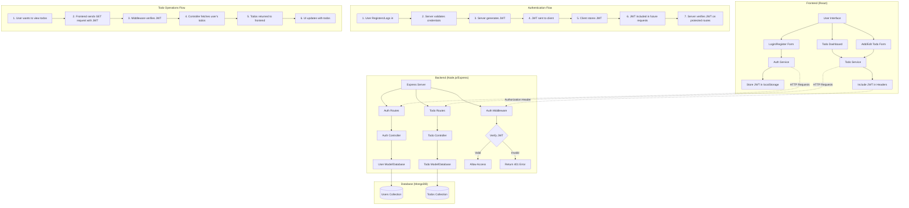

```mermaid
graph TB
    subgraph "Frontend (React)"
        A[User Interface] --> B[Login/Register Form]
        A --> C[Todo Dashboard]
        A --> D[Add/Edit Todo Form]

        B --> E[Auth Service]
        C --> F[Todo Service]
        D --> F

        E --> G[Store JWT in localStorage]
        F --> H[Include JWT in Headers]
    end

    subgraph "Backend (Node.js/Express)"
        I[Express Server] --> J[Auth Routes]
        I --> K[Todo Routes]
        I --> L[Auth Middleware]

        J --> M[Auth Controller]
        K --> N[Todo Controller]

        M --> O[User Model/Database]
        N --> P[Todo Model/Database]

        L --> Q{Verify JWT}
        Q -->|Valid| R[Allow Access]
        Q -->|Invalid| S[Return 401 Error]
    end

    subgraph "Database (MongoDB)"
        O --> T[(Users Collection)]
        P --> U[(Todos Collection)]
    end

    subgraph "Authentication Flow"
        V[1. User Registers/Logs in] --> W[2. Server validates credentials]
        W --> X[3. Server generates JWT]
        X --> Y[4. JWT sent to client]
        Y --> Z[5. Client stores JWT]
        Z --> AA[6. JWT included in future requests]
        AA --> BB[7. Server verifies JWT on protected routes]
    end

    subgraph "Todo Operations Flow"
        CC[1. User wants to view todos] --> DD[2. Frontend sends GET request with JWT]
        DD --> EE[3. Middleware verifies JWT]
        EE --> FF[4. Controller fetches user's todos]
        FF --> GG[5. Todos returned to frontend]
        GG --> HH[6. UI updates with todos]
    end

    E -.->|HTTP Requests| J
    F -.->|HTTP Requests| K
    H -.->|Authorization Header| L
```
