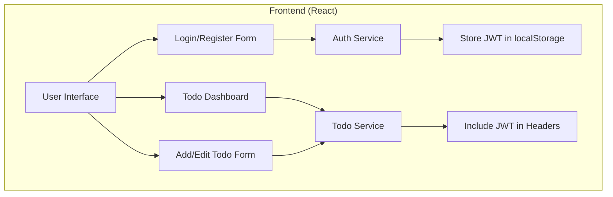

```mermaid
graph TB
    subgraph "Frontend (React)"
        A[User Interface] --> B[Login/Register Form]
        A --> C[Todo Dashboard]
        A --> D[Add/Edit Todo Form]

        B --> E[Auth Service]
        C --> F[Todo Service]
        D --> F

        E --> G[Store JWT in localStorage]
        F --> H[Include JWT in Headers]
    end
```
