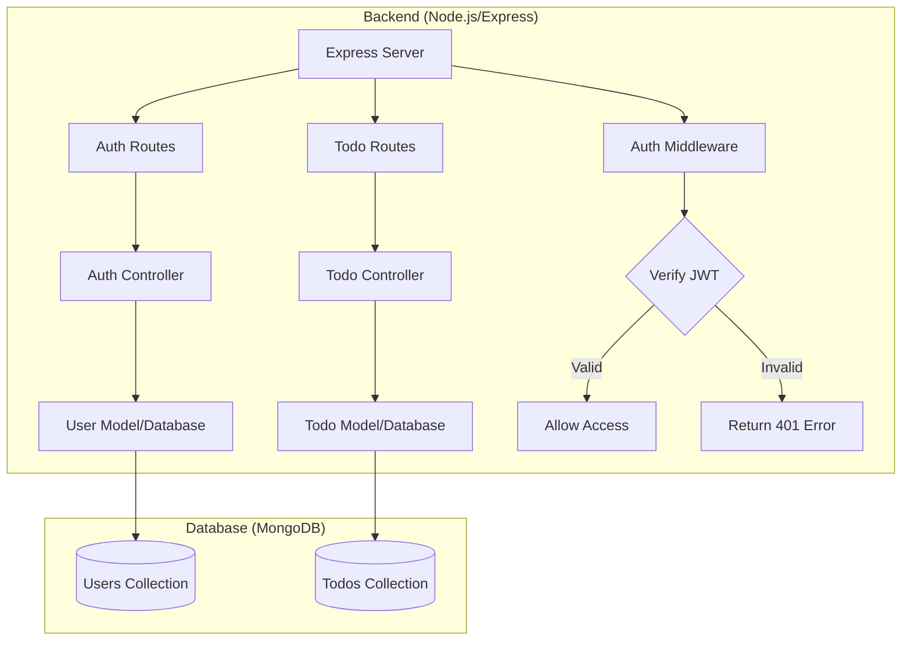

# Realtime Todo Application - Server

A robust Node.js/Express backend service for the Realtime Todo Application with MongoDB integration.

## 🏗️ Architecture



## 📋 Features

- RESTful API Design
- JWT Authentication
- MongoDB Integration
- Input Validation
- Error Handling
- Middleware Support
- Environment Configuration
- Security Best Practices

## 🚀 Getting Started

### Prerequisites

- Node.js (v16 or higher)
- MongoDB (v4.4 or higher)
- npm or yarn

### Installation

1. Clone the repository:

   ```bash
   git clone <repository-url>
   cd realtime-todo/server
   ```

2. Install dependencies:

   ```bash
   npm install
   ```

3. Create a `.env` file:

   ```env
   PORT=3000
   MONGODB_URI=mongodb://localhost:27017/todo_app
   JWT_SECRET=your_jwt_secret
   NODE_ENV=development
   ```

4. Start the server:
   ```bash
   npm run dev
   ```

## 📁 Project Structure

```
src/
├── config/             # Configuration files
├── controllers/        # Request handlers
├── middleware/         # Custom middleware
├── models/            # Database models
├── routes/            # API routes
└── utils/             # Utility functions
```

## 🔑 API Documentation

### Authentication Endpoints

#### POST /api/auth/register

Register a new user

- Body: `{ username, email, password }`
- Returns: User object with JWT token

#### POST /api/auth/login

Authenticate user

- Body: `{ email, password }`
- Returns: JWT token and user info

### Todo Endpoints

#### GET /api/todos

Get all todos for authenticated user

- Header: `Authorization: Bearer <token>`
- Returns: Array of todos

#### POST /api/todos

Create new todo

- Header: `Authorization: Bearer <token>`
- Body: `{ title, description, dueDate }`
- Returns: Created todo object

#### PUT /api/todos/:id

Update todo

- Header: `Authorization: Bearer <token>`
- Body: `{ title, description, status, dueDate }`
- Returns: Updated todo object

#### DELETE /api/todos/:id

Delete todo

- Header: `Authorization: Bearer <token>`
- Returns: Success message

## 💾 Database Models

### User Model

```javascript
{
  username: String,
  email: String,
  password: String (hashed),
  createdAt: Date,
  updatedAt: Date
}
```

### Todo Model

```javascript
{
  title: String,
  description: String,
  status: String,
  dueDate: Date,
  userId: ObjectId,
  createdAt: Date,
  updatedAt: Date
}
```

## 🛡️ Security Features

- Password Hashing
- JWT Authentication
- Request Validation
- XSS Protection
- Rate Limiting
- CORS Configuration
- Error Handling

## ⚙️ Configuration

### Environment Variables

- `PORT`: Server port (default: 3000)
- `MONGODB_URI`: MongoDB connection string
- `JWT_SECRET`: Secret for JWT signing
- `NODE_ENV`: Environment (development/production)

### Database Configuration

Database configuration can be found in `src/config/database.js`.

## 🔧 Development

### Running Tests

```bash
npm test
```

### Linting

```bash
npm run lint
```

## 📈 Performance Monitoring

The server includes:

- Request Logging
- Error Tracking
- Performance Metrics
- Database Query Optimization

## 🚀 Deployment

### Production Setup

1. Set environment variables
2. Build the application
3. Start the server:
   ```bash
   npm start
   ```

### Docker Support

Dockerfile and docker-compose configuration available for containerized deployment.

## 🤝 Contributing

1. Fork the repository
2. Create a feature branch
3. Commit changes
4. Push to the branch
5. Open a Pull Request

## 📝 License

This project is licensed under the MIT License.
