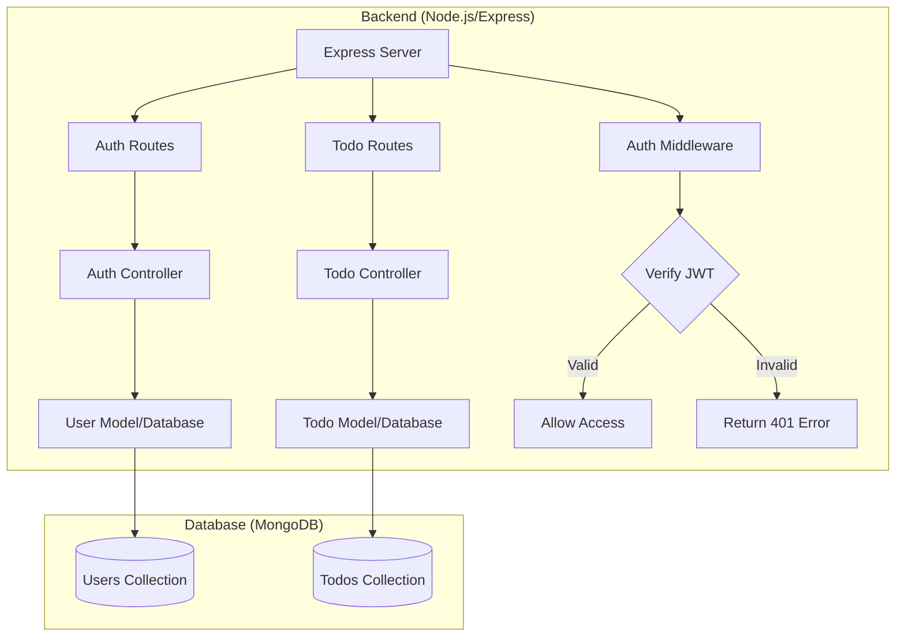

```mermaid
graph TB
    subgraph "Backend (Node.js/Express)"
        I[Express Server] --> J[Auth Routes]
        I --> K[Todo Routes]
        I --> L[Auth Middleware]

        J --> M[Auth Controller]
        K --> N[Todo Controller]

        M --> O[User Model/Database]
        N --> P[Todo Model/Database]

        L --> Q{Verify JWT}
        Q -->|Valid| R[Allow Access]
        Q -->|Invalid| S[Return 401 Error]
    end

    subgraph "Database (MongoDB)"
        O --> T[(Users Collection)]
        P --> U[(Todos Collection)]
    end
```
